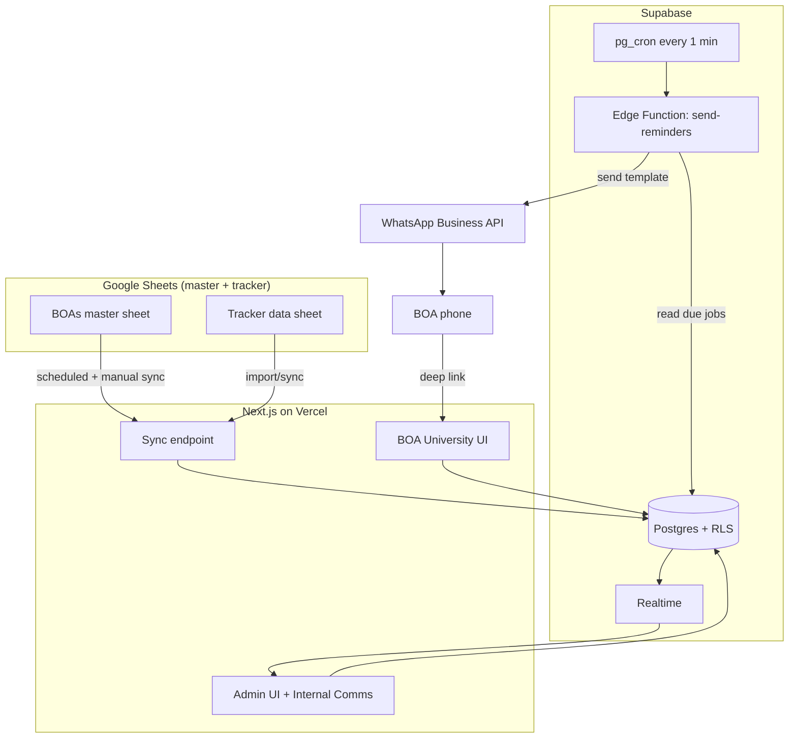
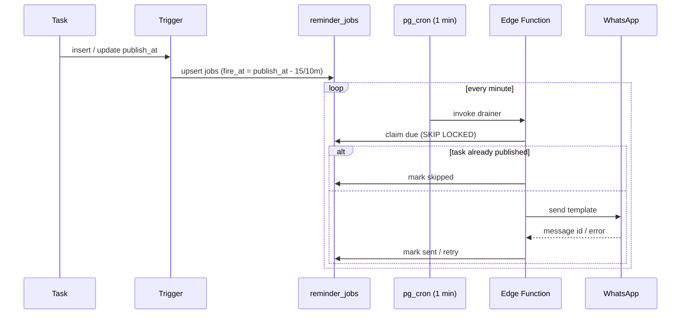
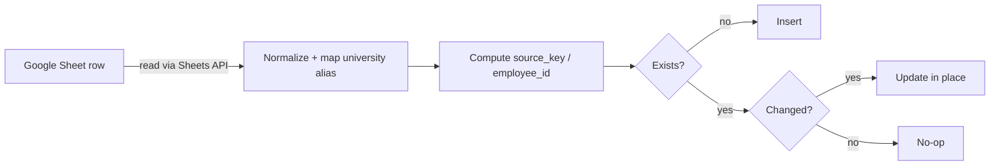

# Communication Query Tracker — System Design (End to End)

**Status:** Draft v1 · **Owner:** Program Ops · **Last updated:** 2026-08-06

This document is the single reference for building the product — from tech stack
to a phased development plan. It reflects decisions made so far: Supabase as the
source of truth, a precomputed reminder queue drained by cron, an Employee-ID-keyed
dynamic sheet sync, and a provider-agnostic WhatsApp sender.

---

## 1. Problem & goals

The Communication team schedules updates (WhatsApp / App posts) for ~19+
universities. Each update has a **publish time**. Today, BOAs miss sending them.

**Goal:** automatically remind the right BOAs on **WhatsApp** a set number of
minutes before each update's publish time (default 15 and 10 min), let them
complete the work in a per-university web dashboard, update status, and let Admins
monitor everything + hold internal communication.

**Non-negotiables**
- **Fast** — reminders fire within ~1 min of their scheduled time.
- **Accurate** — no missed reminders, no duplicates, no reminders for done work.
- **Scale** — 300–500 concurrent users; 10k–50k+ task rows (already ~6.9k today).
- **Dynamic** — new universities / BOAs added via a sheet, zero code changes, no conflicts.

---

## 2. Users & roles

| Role | Who | Can see | Can do |
|---|---|---|---|
| **BOA** | University communication officer | Only their university's tasks (RLS-enforced) | Update status, actual publish date, log blockers |
| **Admin** | Comms / Program Ops team | Everything, all universities | Track/monitor, schedule updates, run sync, internal comms |
| **Escalation contact** | Lead / manager | (notified only) | Receives WhatsApp if an item is unpublished at publish time |

---

## 3. Tech stack (and why)

| Concern | Choice | Why this and not the alternative |
|---|---|---|
| Database | **Supabase Postgres** (Pro) | Already owned; relational data + strong indexing handles 50k rows trivially; RLS gives per-university isolation without app code |
| Auth | **Supabase Auth** (email magic-link / OTP) | Native to the DB; role + BOA link stored in `app_users`; powers RLS |
| Authorization | **Postgres RLS** | Security enforced at the data layer — a bug in the UI can't leak another university's data |
| Realtime | **Supabase Realtime** | Live admin dashboard without polling |
| Scheduler | **pg_cron** (in Supabase) | Runs the reminder drainer every minute, in-DB, no extra infra |
| Job draining / sending | **Supabase Edge Function** (Deno/TS) | Serverless; called by cron; talks to WhatsApp API |
| Web app | **Next.js (App Router)** on **Vercel** | One codebase for BOA + Admin UIs; SSR + RSC; fast; easy deep links |
| Connection pooling | **Supavisor** (transaction mode) | Survives 300–500 concurrent clients on a single Postgres |
| WhatsApp | **Provider-agnostic interface** → Meta Cloud API **or** BSP (AiSensy/Interakt) | Swap providers without touching business logic |
| Sheet integration | **Google Sheets API** + service account | Read BOA master + tracker data; upsert into Supabase |
| Language | **TypeScript** everywhere | Shared types between web, edge functions, scripts |

---

## 4. High-level architecture



**Flow in one sentence:** Comms schedules a task → a trigger precomputes reminder
jobs → cron drains due jobs → Edge Function sends WhatsApp → BOA taps the deep
link → completes work in their UI → status updates live on the Admin dashboard.

---

## 5. Data model

Full DDL lives in `supabase/migrations/`. Summary:

| Table | Purpose | Key columns |
|---|---|---|
| `universities` | Master list (incl. upcoming) | `code` (slug), `aliases[]`, `go_live_date`, `active` |
| `boas` | People who get reminders | **`employee_id` (stable key)**, `whatsapp_e164`, `designation`, `active` |
| `university_boas` | Assignment (BOA↔uni) | `role` (primary/backup), `team_scope`, `receive_reminders` |
| `escalation_contacts` | Who to alert if unpublished at publish time | `university_id?`, `whatsapp_e164` |
| `app_users` | Auth users → role + BOA link | `role`, `boa_id` |
| `tasks` | One row per scheduled update | `publish_at` (UTC), `execution_status`, `priority`, `team`, `message_content`, `source_key` |
| `reminder_jobs` | Precomputed reminders | `fire_at`, `status`, `offset_min`, unique `(task_id, boa_id, offset_min)` |
| `app_settings` | Global config | `default_reminder_offsets_min` (`{15,10}`) |
| `internal_messages` | Admin-only comms | `author_id`, `body` |
| `audit_log` | Change history | `entity`, `action`, `changes` |

**Design choices**
- **Stable keys** (`employee_id`, university `code`) make the sheet sync idempotent → no duplicates.
- **All timestamps stored UTC**, rendered **Asia/Kolkata** in UI + messages (India has no DST).
- **Evolving taxonomies** (`team`, `category`, `channel`, `content_type`) are text backed by `ref_*` tables → new values need no migration.
- **Stable enums** (`execution_status`, `priority`) are Postgres enums → drive logic safely.

---

## 6. The reminder engine (accuracy-critical core)

**Principle: don't scan the whole table every minute — precompute jobs.**

### 6.1 Job generation (on write)
When a task is inserted or its `publish_at` / university / status changes, a
trigger regenerates its `reminder_jobs`:
- For each reminder offset (default 15 & 10 min) × each eligible BOA of the
  target university (respecting `team_scope` + `receive_reminders`), insert a job
  with `fire_at = publish_at - offset`.
- On `publish_at` change: recompute pending jobs; already-sent jobs are left alone.
- The unique constraint `(task_id, boa_id, offset_min)` makes this safe to re-run.

### 6.2 Draining (every minute)
`pg_cron` calls the drainer each minute. It claims only the due slice:

```sql
select * from reminder_jobs
where status = 'pending' and fire_at <= now()
order by fire_at
for update skip locked        -- parallel workers never double-send
limit 200;
```

For each job: **skip** if the task is already `published`; otherwise call the
WhatsApp sender → mark `sent` (+ store `wa_message_id`), or `failed` (retry with
backoff up to N attempts, then raise to the Admin dashboard + escalation).



**Why this is fast + efficient + accurate**
- *Accurate:* `SKIP LOCKED` + unique constraint ⇒ no duplicate pings; `published`-check ⇒ no reminder for finished work.
- *Efficient:* a **partial index** on `(fire_at) where status='pending'` means the drainer touches a tiny slice — same cost at 1k or 50k tasks.
- *Fast:* reminders go out within the 1-min tick; the 15/10-min offsets absorb the jitter.
- *Scalable:* stateless Edge Function; add a second worker any time — `SKIP LOCKED` makes it horizontally safe.

### 6.3 Escalation
A second cron pass finds tasks with `publish_at <= now()` still not `published`
and pings the university's escalation contact once.

---

## 7. WhatsApp integration

Business-initiated WhatsApp requires a **pre-approved template** (you can't
free-text a user outside a 24h window). We register a **utility-category** template
(cheaper than marketing) with variables, and send it via a swappable provider.

### 7.1 Provider interface
```ts
interface WhatsAppProvider {
  sendTemplate(to: string, template: string, vars: Record<string,string>): Promise<{ id: string }>
}
// impls: MockProvider (dev) · MetaCloudProvider · BspProvider (AiSensy/Interakt)
```
Business logic depends only on this interface. `WHATSAPP_PROVIDER` env selects it.

### 7.2 Message content
Long `Message / Content` + posters read badly on a phone and hit template limits,
so the reminder carries the **essentials + a deep link**; the full content lives
on the task page:

```
🔔 Publish reminder — {University}
Priority: {Priority} | Channel: {Channel} | Type: {Content Type}
Team: {Team} · {Update Type} / {Category}
Publish at: {Publish At IST}  (in {minutes} min)
Notes: {Special Instructions}
👉 Open & complete: {deep link → /u/{code}/task/{id}}
```
The deep link opens the BOA straight to that task, where they see the full
message, poster preview, and the update controls.

---

## 8. Dynamic sheet sync (no conflicts)

Two sheets, both synced idempotently into Supabase.

### 8.1 BOA master sheet
Keyed by **Employee ID** (BOA), **university code** (auto-created from the
`University` column if new), and `team_scope` (assignment). On each sync:
- new row → insert; changed row → update in place (matched by key); missing row →
  mark assignment inactive (reversible). Runs on a schedule (~15 min) and via an
  Admin **"Sync now"** button. See `docs/BOA_INTAKE_FORMAT.md`.

### 8.2 Tracker data sheet
The existing tracker (~6.9k rows). Options:
- **Recommended:** one-way **Sheet → Supabase** import; new task entry moves into
  the Admin UI. `source_key` (hash of stable row identity) makes re-import idempotent.
- If the team must keep entering in Sheets: Apps Script `onEdit` → webhook, plus a
  nightly reconciliation. (Two-way sync is avoided — it's the main source of silent
  corruption.)



---

## 9. The two UIs

### 9.1 BOA University UI (`role = boa`)
- Auth via magic link; RLS scopes them to their assigned university/universities.
- **Deep link lands on the exact task.**
- Board: **Today / Upcoming / Overdue / Blocked** for their university only.
- Task page: full message + poster; actions — mark *In Progress* / *Published*,
  set *Actual Publish Date*, log *Issue / Blocker*. Writes straight to `tasks`.

### 9.2 Admin UI (`role = admin`)
- Global board across all universities; live via Realtime.
- **Reminder delivery log** (sent / failed / skipped) — see who was pinged.
- **Internal communication panel** (`internal_messages`) — admin-only, enforced by RLS.
- **Schedule / edit tasks**; **Sync now**; manage universities + BOAs + escalation.
- Onboard a new university = add data; triggers, RLS, reminders all just work.

---

## 10. Security

- **RLS on every table.** BOA reads/writes only tasks whose university is in their
  assignment set; `internal_messages` readable only by admins; `boas`/`universities`
  writable only by admins (or the service role during sync).
- **Least privilege keys:** browser uses the anon key (RLS-gated); sync + edge
  functions use the service-role key server-side only.
- **PII:** WhatsApp numbers/emails live only in Supabase; never in URLs/query
  strings; sheet shared domain-restricted (nxtwave.co.in), not public.
- **Idempotency & audit:** unique constraints prevent duplicate sends; `audit_log`
  records task changes with actor + diff.

---

## 11. Scale & performance

| Dimension | Target | How it's met |
|---|---|---|
| Task rows | 10k–50k+ | B-tree + partial indexes; queries hit small slices |
| Concurrent users | 300–500 | Supavisor transaction pooling; short RLS-scoped reads/writes |
| Reminder timeliness | ≤ ~1 min | 1-min cron + precomputed jobs |
| Reminder cost at scale | flat | partial index on due+pending slice only |
| Live dashboard | admins | Realtime for admin; BOA UIs use scoped queries/polling to stay under Realtime connection limits |
| Horizontal send throughput | high | stateless Edge Function + `SKIP LOCKED` allows N parallel drainers |

---

## 12. Reliability & observability

- **Retries with backoff** on WhatsApp failures; after N attempts → `failed` + alert.
- **Dead-letter view:** admin sees failed jobs and can retry manually.
- **Idempotent everything:** sync re-runs and drainer re-runs are safe.
- **Monitoring:** delivery-rate metric, failed-job count, sync freshness
  (`last_synced_at`), and cron heartbeat surfaced on the Admin dashboard.
- **Timezone correctness tests** (publish_at math around IST) in CI.

---

## 13. Deployment & environments

| Env | DB | Web | Purpose |
|---|---|---|---|
| **dev** | local Supabase / a dev project | `next dev` | build + test |
| **staging** | Supabase staging project | Vercel preview | UAT with real templates (test numbers) |
| **prod** | Supabase Pro project | Vercel prod | live |

- **Migrations** versioned in `supabase/migrations`, applied via `supabase db push` in CI.
- **CI:** typecheck + lint + unit tests (reminder math, sync mapping) on PR;
  migrations + deploy on merge to `main`.
- **Secrets** in Vercel/Supabase env, never in the repo.

---

## 14. Development plan (phased)

| Phase | Deliverable | Notes |
|---|---|---|
| **0. Foundation** (done/in progress) | Schema, RLS, reminder engine SQL, intake doc + sheet | current work |
| **1. Data in** | University seed + tracker import; BOA master sync (mock data) | validates the model against real ~6.9k rows |
| **2. Reminder engine live** | Triggers + pg_cron + Edge Function with **mock** sender + delivery log | prove timing/accuracy before spending on WhatsApp |
| **3. WhatsApp** | Template approval + Meta/BSP provider; deep links | swap mock → real |
| **4. BOA UI** | Auth, per-uni board, task page, status updates | RLS-gated |
| **5. Admin UI** | Global tracking board, delivery log, internal comms, sync button | Realtime |
| **6. Hardening** | Escalation, retries/dead-letter, load test to 500, monitoring | go-live readiness |
| **7. Rollout** | Pilot 1–2 universities → all | staged |

**Critical path:** Phase 2 (engine) is the riskiest/most valuable — build and
verify it with the mock sender *before* WhatsApp onboarding, so timing bugs are
caught cheaply.

---

## 15. Rough cost

| Item | Estimate |
|---|---|
| Supabase Pro | ~$25/mo (already have) |
| Vercel | Hobby → Pro (~$20/mo) as traffic grows |
| WhatsApp (utility templates) | pay-per-conversation; a few hundred BOAs × few msgs/day is low volume — budget conservatively, confirm with provider |
| Google Sheets API | free tier sufficient |

---

## 16. Open decisions (need your input)

1. **WhatsApp provider** — Meta Cloud API (direct, cheaper, more setup) vs BSP like AiSensy/Interakt (faster onboarding, dashboards)?
2. **Tracker data source of truth** — move task entry into the Admin UI (recommended), or keep entering in Google Sheets with sync?
3. **Message detail** — essentials + deep link (recommended) vs pack every column into WhatsApp text?
4. **Reminder offsets** — confirm default 15 & 10 min; any per-priority variation (e.g. Critical gets an extra 30-min ping)?
